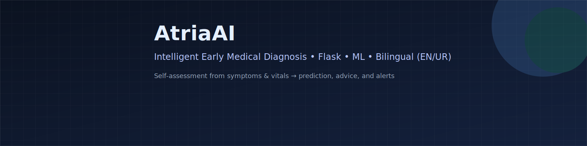

<!-- Banner -->
<p align="center">
  
</p>

<p align="center">
  <a href="https://github.com/UsamaMatrix/Atria-AI/stargazers"></a>
  <a href="https://github.com/UsamaMatrix/Atria-AI/network/members"></a>
  <a href="https://github.com/UsamaMatrix/Atria-AI/issues"></a>
  <a href="LICENSE"></a>
  
</p>

<h1 align="center">🩺 AtriaAI — Intelligent Early Medical Diagnosis System</h1>
<p align="center">
  <i>Web-based ML-powered assistant for early symptom assessment with bilingual (English/Urdu) support.</i>
</p>

---

## 📑 Table of Contents
- [Overview](#-overview)
- [Objectives](#-objectives)
- [Key Features](#-key-features)
- [Architecture](#-architecture)
- [Tech Stack & Badges](#-tech-stack--badges)
- [Screenshots](#-screenshots)
- [Quickstart](#-quickstart)
- [Configuration](#-configuration)
- [API Endpoints](#-api-endpoints)
- [Project Structure](#-project-structure)
- [Security & Privacy](#-security--privacy)
- [Roadmap](#-roadmap)
- [Contributing](#-contributing)
- [License](#-license)
- [Disclaimer](#-disclaimer)
- [Urdu (اردو) Summary](#-urdu-اردو-summary)
- [Assets Inventory](#-assets-inventory)

---

## 🧠 Overview
**AtriaAI** helps patients perform an **early self-assessment** using symptoms and vitals (height, weight, BP, temperature). A trained **ML model** (`model.pkl`) runs on the server and returns a **possible condition** with **precautions**, **OTC suggestions**, and **doctor alerts** for critical cases.

> ⚠️ AtriaAI **does not replace** clinical diagnosis. It is an **assistive tool** for awareness and timely consultation.

---

## 🎯 Objectives
- Enable quick, simple **self-checks** via a clean, accessible UI.
- Provide **bilingual** (English/Urdu) outputs with non-technical explanations.
- Suggest **precautions**, **home remedies**, and **exercise** tips.
- Trigger **consultation alerts** for red-flag scenarios.

---

## ✅ Key Features
- **Auth & Profiles**: Registration, login, profile management.
- **Vitals & Symptoms**: Height, weight, BP, temp, and free-text symptoms.
- **Real-time Inference**: Flask loads `model.pkl` and predicts on submit.
- **Recommendations**: OTC guidance, home remedies, doctor alerts.
- **Bilingual UX**: English + Urdu forms, labels, and results.
- **History & Logs**: View past predictions per user.
- **Admin Dashboard**: Users overview, audit, model health (basic).
- **MySQL-backed**: Persistent storage for users and history.

---

## 🧩 Architecture

```mermaid
flowchart TD
    A[User (Web/Mobile)] -->|Forms/Requests| B[Flask App]
    B --> C[Validation + Preprocess]
    C --> D[ML Model (model.pkl)]
    D --> E[Prediction + Confidence]
    E --> F[Recommendation Engine]
    F --> G[Response Formatter (EN/UR)]
    B <-->|ORM/SQL| H[(MySQL)]
````

---

## 🛠 Tech Stack & Badges

<p>
  
  
  
  
  
  
  
  
  
  
  
  
</p>

---

## 🖼 Screenshots

> Place these images under the listed paths; filenames are already referenced below.

<p align="center">
  
  
</p>

<p align="center">
  
  
</p>

<p align="center">
  
  
</p>

---

## 🚀 Quickstart

### 1) Clone

```bash
git clone https://github.com/UsamaMatrix/Atria-AI.git
cd Atria-AI
```

### 2) Virtual Env

```bash
python -m venv .venv
# Windows
.venv\Scripts\activate
# macOS/Linux
source .venv/bin/activate
```

### 3) Install

```bash
pip install -r requirements.txt
```

### 4) Configure `.env`

```ini
# Flask
FLASK_ENV=development
SECRET_KEY=change_this_secret

# DB
DB_HOST=127.0.0.1
DB_PORT=3306
DB_USER=atria_user
DB_PASSWORD=strong_password
DB_NAME=atria_db
DATABASE_URL=mysql+pymysql://${DB_USER}:${DB_PASSWORD}@${DB_HOST}:${DB_PORT}/${DB_NAME}

# ML
MODEL_PATH=ml/model.pkl

# i18n
DEFAULT_LANG=en
FALLBACK_LANG=en
```

### 5) DB Init (example)

```bash
python manage.py db upgrade   # or run provided init script
```

### 6) Run

```bash
flask --app app run --debug
# http://127.0.0.1:5000
```

---

## 🔧 Configuration

* **Language**: Default via `DEFAULT_LANG`. Toggle per-user in profile.
* **Model**: Path configurable via `MODEL_PATH`. Replace `ml/model.pkl` with a new export when retraining.
* **Security**: Use a strong `SECRET_KEY`. Enable HTTPS and secure cookies in production.

---

## 🔌 API Endpoints

| Method | Endpoint     | Description                           |
| -----: | ------------ | ------------------------------------- |
|    GET | `/`          | Health check / landing                |
|    GET | `/login`     | Login form                            |
|   POST | `/login`     | Authenticate                          |
|    GET | `/register`  | Registration form                     |
|   POST | `/register`  | Create new user                       |
|    GET | `/dashboard` | User dashboard                        |
|   POST | `/predict`   | Submit vitals & symptoms → prediction |
|    GET | `/history`   | Current user’s prediction history     |
|   POST | `/logout`    | End session                           |

**/predict — Request**

```json
{
  "height_cm": 175,
  "weight_kg": 78,
  "bp_systolic": 120,
  "bp_diastolic": 80,
  "temperature_c": 37.2,
  "symptoms": "headache, fatigue, mild cough"
}
```

**/predict — Response**

```json
{
  "prediction": "Viral Infection (mild)",
  "confidence": 0.82,
  "advice": {
    "medicines": ["paracetamol 500mg (if needed)", "oral hydration salts"],
    "home_remedies": ["rest", "warm fluids"],
    "exercises": ["light stretching only"],
    "consult_doctor": false,
    "alerts": ["if fever > 38.5°C for 48h, seek medical attention"]
  },
  "lang": "en"
}
```

---

## 🗂 Project Structure

```
Atria-AI/
├── app/
│   ├── __init__.py
│   ├── routes.py
│   ├── models.py
│   ├── services/
│   │   ├── inference.py        # loads model.pkl, schema, predict()
│   │   └── recommend.py        # rules for meds/exercises/alerts
│   ├── i18n/
│   │   ├── en.json
│   │   └── ur.json
│   ├── templates/
│   │   ├── base.html
│   │   ├── auth/
│   │   │   ├── login.html
│   │   │   └── register.html
│   │   └── dashboard/
│   │       ├── patient.html
│   │       └── admin.html
│   └── static/
│       ├── css/
│       └── js/
├── assets/
│   ├── banner/
│   │   └── atriavai-banner.svg
│   └── screens/
│       ├── login-light.png
│       ├── login-dark.png
│       ├── dashboard-patient-light.png
│       ├── dashboard-patient-dark.png
│       ├── dashboard-admin-light.png
│       └── dashboard-admin-dark.png
├── ml/
│   ├── data/
│   ├── notebooks/
│   ├── training.py
│   └── model.pkl
├── migrations/
├── tests/
├── requirements.txt
├── .env.example
├── manage.py
└── README.md
```

---

## 🔒 Security & Privacy

* **Passwords**: Hash + salt (e.g., `werkzeug.security` / `passlib`).
* **CSRF**: Protect forms (e.g., `Flask-WTF`).
* **Validation**: Strict input schema (e.g., `pydantic`/`marshmallow`).
* **Logs**: Avoid PHI; redact sensitive fields.
* **RBAC**: Reserved for admin features and future doctor roles.
* **Headers**: Enforce HTTPS, HSTS, CSP, and secure cookies in production.

---

## 🗺 Roadmap

* [ ] Symptom NLP (entities + negation handling)
* [ ] Differential multi-condition outputs
* [ ] Doctor directory + appointment integration
* [ ] Model monitoring + drift detection
* [ ] Dockerfile + CI/CD (GitHub Actions)
* [ ] PWA features + offline cache

---

## 🤝 Contributing

1. Fork the repo
2. Create a feature branch
3. Commit with clear messages
4. Open a PR with context and screenshots

<p>
  
  
</p>

---

## 📄 License

Licensed under the **MIT License**. See [`LICENSE`](LICENSE).

---

## ⚠️ Disclaimer

AtriaAI provides **informational guidance only** and **does not** replace professional medical diagnosis, treatment, or advice. Always consult a qualified healthcare provider for serious or persistent symptoms or before taking any medication.

---

## 🗣 Urdu (اردو) Summary

**AtriaAI** ایک ویب بیسڈ سسٹم ہے جو علامات اور بنیادی ویٹلز (قد، وزن، بلڈ پریشر، درجہ حرارت) کی بنیاد پر ابتدائی خود جانچ میں مدد دیتا ہے۔

* ممکنہ بیماری/حالت کی **پیش گوئی**
* **احتیاطی تجاویز**، گھریلو علاج، ہلکی ورزشیں
* **ڈاکٹر سے رجوع** کی وارننگ اگر مسئلہ سنگین ہو

> یہ سسٹم ڈاکٹر کا متبادل نہیں، صرف ابتدائی رہنمائی کے لیے ہے۔

---

## 🗂 Assets Inventory

Place these files in the repo to match references above:

```
assets/
├── banner/
│   └── atriavai-banner.svg                # top README banner
└── screens/
    ├── login-light.png                    # login page (light)
    ├── login-dark.png                     # login page (dark)
    ├── dashboard-patient-light.png        # patient dashboard (light)
    ├── dashboard-patient-dark.png         # patient dashboard (dark)
    ├── dashboard-admin-light.png          # admin dashboard (light)
    └── dashboard-admin-dark.png           # admin dashboard (dark)
```

> Tip: Keep screenshots ~1400px width for crisp README rendering.

